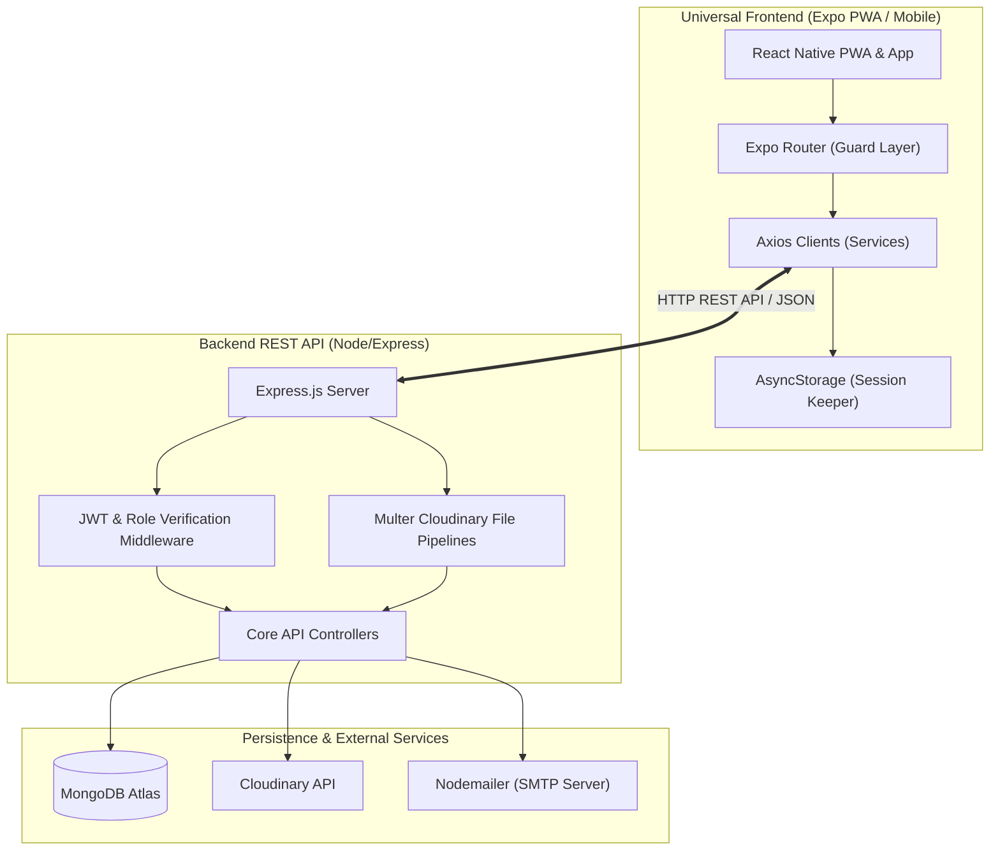

<div align="center">

# 🌴 HD Resorts
### *Sri Lanka's Premium Travel Discovery & Booking Companion*

**A feature-rich, high-fidelity MERN stack travel companion platform with cross-platform PWA support, multi-role client portals, secure OTP authentication, and dynamic media uploads.**

---

[](https://reactnative.dev)
[](https://expo.dev)
[](https://nodejs.org)
[](https://expressjs.com)
[](https://www.mongodb.com)
[](https://cloudinary.com)

<!-- Live GitHub stats -->


</div>

---

## 📖 Table of Contents
* [🌴 Overview](#-overview)
* [✨ Features & Capabilities](#-features--capabilities)
* [🗺️ High-Level System Architecture](#️-high-level-system-architecture)
* [🔐 Role-Based Access Control (RBAC)](#-role-based-access-control-rbac)
* [🚀 API Endpoint Matrix](#-api-endpoint-matrix)
* [📦 Project Codebase Structure](#-project-codebase-structure)
* [🛠️ Installation & Quick Start](#️-installation--quick-start)

---

## 🌴 Overview

**HD Resorts** is a production-ready, modular travel ecosystem crafted for the ultimate Sri Lankan exploration experience. It integrates a client-facing discovery feed for tourists, specialized business portals for regional service providers (Hosts, Guides, Event Coordinators, Activity Planners), and an administrative back-office system into a unified application.

Using **React Native Web**, the client application compiled via **Expo** delivers a high-fidelity native application experience on Android & iOS while doubling as a highly responsive PWA (Progressive Web App) for desktop browsers.

---

## ✨ Features & Capabilities

* **📱 Multi-Platform PWA**: Runs natively on iOS and Android while offering a polished web layout.
* **🔑 Dynamic Role-Based Auth**: Fully customizable JWT authorization with automatic router level guards.
* **📸 Cloud-Hosted Media**: Automatic multipart form handling using Multer, storing listings and profile images securely in Cloudinary.
* **💬 Community Engagement**: Integrated listing reviews, rating engines, and visual feedback uploads.
* **🏝️ Hidden Spots Discovery**: User-contributed community map points and attractions modules to discover pristine, secret Sri Lankan gems.
* **⚙️ Developer Demo Mode**: Built-in OTP and SMTP bypass mechanisms to allow instant evaluation on server hosting free-tiers.

---

## 🗺️ High-Level System Architecture



---

## 🔐 Role-Based Access Control (RBAC)

The application segments features and views using a granular role structure:

| User Role | View Privileges | Mutate / CRUD Capabilities |
|---|---|---|
| **Explorer** | Feeds, Attractions, Active Listings, Community Reviews | Submit reviews with images, post hidden "Attractions", request upgrade to Provider |
| **Provider** | Personalized dashboards corresponding to provider subtype | Full CRUD on listings (Homestays, Guiding Services, Events, Activities) and incoming bookings |
| **Admin** | Global platform oversight dashboard, user matrix | Complete control to moderate listings, remove inappropriate comments/reviews, alter user roles |

---

## 🚀 API Endpoint Matrix

All backend routes are prefixed with `/api` and return standardized JSON packages.

### 🔐 Authentication (`/api/auth`)
| Method | Endpoint | Authorization | Description |
|:---:|---|:---:|---|
| **POST** | `/register` | Public | Register user account with optional `profilePhoto` upload |
| **POST** | `/login` | Public | Authenticate credentials and return JWT & user details |
| **POST** | `/verify-email` | Public | Submit dynamic OTP token to verify email address |
| **POST** | `/resend-verification`| Public | Request email validation code dispatch |
| **POST** | `/forgot-password` | Public | Start password recovery pipeline |
| **PUT** | `/reset-password/:token`| Public | Complete password reset using active token |
| **POST** | `/google` | Public | Authenticate via Google OAuth credentials |

### 👤 Profile & User Operations (`/api/users`)
| Method | Endpoint | Authorization | Description |
|:---:|---|:---:|---|
| **GET** | `/me` | JWT | Get current user's profile information |
| **PUT** | `/me` | JWT | Edit profile settings & custom photo |
| **DELETE**| `/me/photo` | JWT | Remove custom profile image |
| **DELETE**| `/me` | JWT | Deactivate and delete current account |
| **PUT** | `/upgrade` | JWT | Request upgrade to a **PROVIDER** role |
| **GET** | `/` | Admin | Get list of all registered platform users |
| **PUT** | `/:id/role` | Admin | Update target user's role settings |
| **DELETE**| `/:id` | Admin | Remove target user account |

### 🏡 Homestays & Travel Services (`/api/homestays`)
| Method | Endpoint | Authorization | Description |
|:---:|---|:---:|---|
| **GET** | `/` | Public | Query list of all active homestay listings |
| **POST** | `/` | Provider / Admin | Create a new homestay listing |
| **GET** | `/:id` | Public | Get information for a specific homestay |
| **PUT** | `/:id` | Provider / Admin | Edit details/image for a homestay |
| **DELETE**| `/:id` | Provider / Admin | Remove homestay listing |

### 💬 Review & Feedback Engine (`/api/reviews`)
| Method | Endpoint | Authorization | Description |
|:---:|---|:---:|---|
| **POST** | `/` | JWT | Write a review on an item with a `reviewPhoto` |
| **GET** | `/:targetId` | Public | Read reviews matching a specified listing ID |
| **PUT** | `/:id` | JWT | Edit your own review and attachment |
| **DELETE**| `/:id` | JWT | Delete a review (Admins can delete any review) |

---

## 📦 Project Codebase Structure

The project maintains a decoupled modular design separating backend APIs from frontend clients:

```
project-root/
├── backend/                      # REST API Server
│   ├── src/
│   │   ├── config/              # MongoDB connection & Cloudinary setup
│   │   ├── controllers/         # Logic controllers (auth, homestay, events, etc.)
│   │   ├── middleware/          # Security filters, JWT decoders, uploads
│   │   ├── models/              # Mongoose database schema models
│   │   ├── routes/              # Express endpoint router wires
│   │   ├── utils/               # SMTP wrappers and helper utilities
│   │   └── server.js            # Express application entrypoint
│   ├── seedEvents.js            # Mock data seeder
│   └── package.json             # Server package configuration
│
└── mobile/                       # Cross-Platform Client
    ├── app/                     # File-based view routers (Expo Router)
    │   ├── (auth)/              # Register, Sign-In, and password recovery views
    │   ├── (tabs)/              # Active Explorer home, provider panels, & settings
    │   └── _layout.tsx          # Nav stack wrapper
    ├── src/
    │   ├── components/          # Reusable visual views (e.g. ReviewList)
    │   ├── config/              # Dynamic local/remote host endpoints
    │   └── services/            # Client Axios APIs
    ├── app.json                 # Expo settings config
    └── package.json             # Mobile application packages
```

---

## 🛠️ Installation & Quick Start

### 📋 Prerequisites
- **Node.js** (v18.x or v20.x recommended)
- **MongoDB** instance (Local or cloud-hosted Atlas database)
- **Expo Go** application installed on your Android/iOS device (optional, to preview native builds)

### 1️⃣ Server Setup
1. Open your terminal, navigate to the backend directory, and install dependencies:
   ```bash
   cd backend
   npm install
   ```
2. Create an environment configuration file named `.env` in the `backend/` directory:
   ```env
   PORT=5000
   MONGO_URI=your_mongodb_atlas_uri
   JWT_SECRET=your_jwt_signing_key
   JWT_EXPIRE=30d
   
   # Cloudinary Keys (For uploads)
   CLOUDINARY_CLOUD_NAME=your_cloudinary_name
   CLOUDINARY_API_KEY=your_cloudinary_key
   CLOUDINARY_API_SECRET=your_cloudinary_secret
   ```
3. Boot up the backend development server:
   ```bash
   npm run dev
   ```

### 2️⃣ Client Setup
1. Navigate to the mobile workspace directory and install client packages:
   ```bash
   cd ../mobile
   npm install
   ```
2. Launch the Expo bundler:
   ```bash
   npx expo start
   ```
3. Press `w` in your terminal to view the application inside your local desktop browser, or scan the generated terminal QR code with your phone to load it inside the **Expo Go** app.


---

<div align="center">
  <sub>Designed with love for travel exploration in beautiful Sri Lanka. 🇱🇰</sub>
</div>
